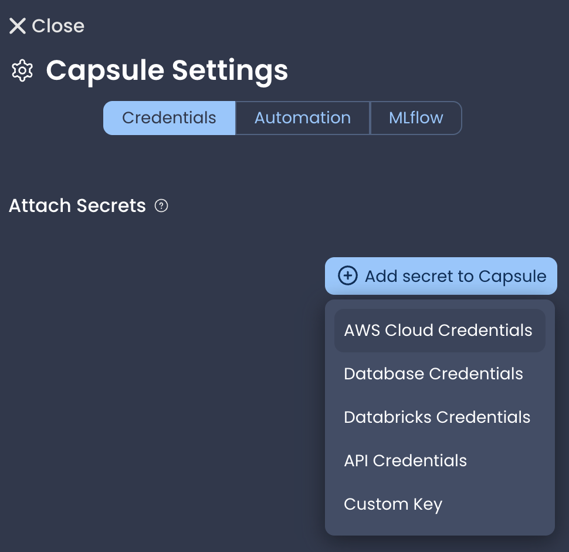
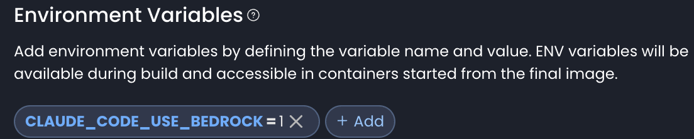

## How to use coding agents in the SWDB Code Ocean environment

This environment comes preinstalled with options for AI coding agent usage: both Copilot and Claude Code are setup for usage within VS Code.

If you have a subscription or API key to either of these (or some other model provider) we prefer you to use those credentials - if you need help with login or configuration, ask Dan or some other TA.

If you need access, we will provide it for you! The SWDB environment is also setup to use shared billing easily.

**For Copilot**: In the *Capsule Settings* menu (gear in the upper right), add an *AWS Cloud Credentials* secret if not already present, and select `AWS Assumable Role - aind-codeocean-user`.

When you launch the capsule after this (you can edit secrets with the workstation paused, doesn't need to be shutdown), you may be get a prompt from the *bedrock-auth* extension to reload the window; following that, you should have a list of models available for Copilot, no login needed.

Note: if working on a shared capsule, adding the secret will update the `secrets.json` - it's fine to commit this to the shared github. Collaborators may see a prompt suggesting they attach a secret in that slot, but it's fine to ignore and run without it.

**For Claude Code**: In the capsule *environment* pane, add two environment variables, `CLAUDE_CODE_USE_BEDROCK=1` and `CLAUDE_CODE_USE_MANTLE=1`. Claude code should work seamlessly after this, either in the editor extension or the integrated terminal.

